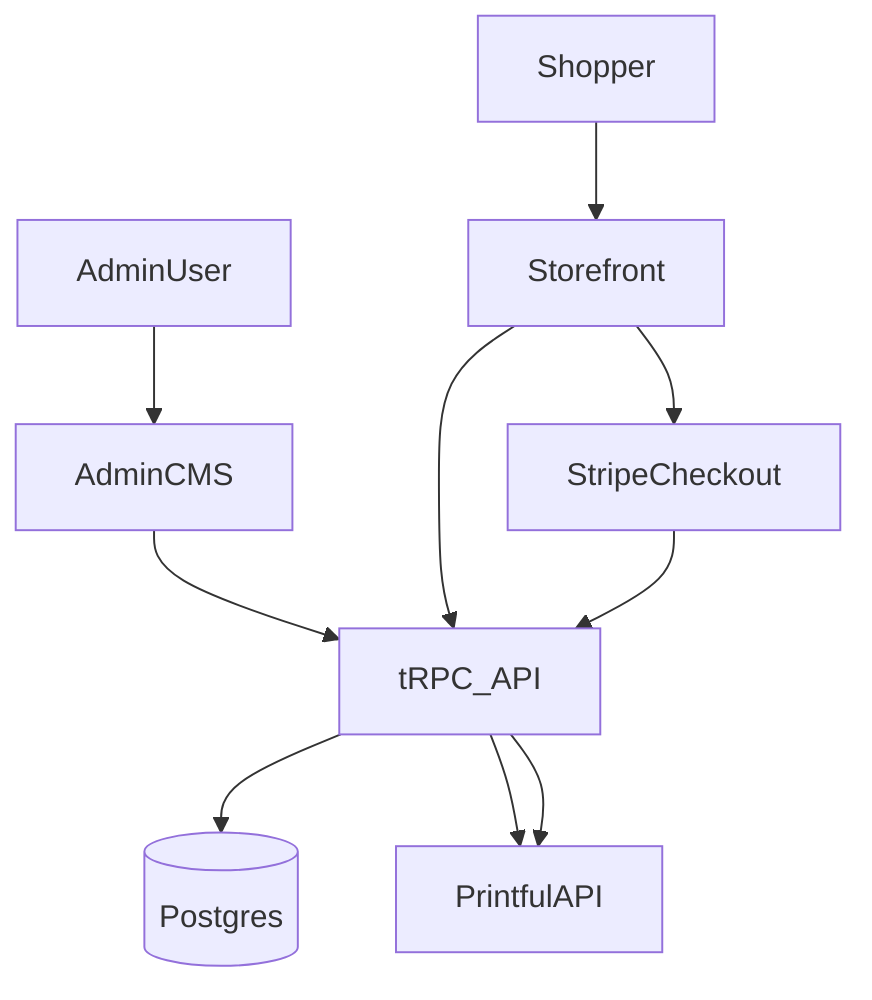

# MVP plan

## Context recap

- Repo is a T3-style Next.js app with tRPC + Drizzle; currently only example `posts` schema and router exist.
- You want: admin-only CMS (simple auth), storefront, Stripe checkout now, and Printful products+orders integration.
- MVP scope is **T-shirts only** for Printful POD.

## Key decisions (assumptions)

- Admin protection is a lightweight allowlist (env-based).
- Stripe is in MVP; Clerk is not included.
- Printful integration includes product/variant sync and order creation on paid checkout; webhooks for status are optional but recommended.
- Print file assets will be stored in object storage with public URLs (DigitalOcean Spaces).

## Plan

1. **Define core domain schema** in [`/Users/dawdii/work/idk/src/server/db/schema.ts`](/Users/dawdii/work/idk/src/server/db/schema.ts)
   - Split schema into multiple files (products, orders, printful) and re-export from `schema.ts`.
   - Add `products`, `product_variants`, `product_images`, `product_drafts`, `orders`, `order_items`, and `printful_sync` tables.
   - Include status fields (draft/published/archived), pricing, Printful IDs, and t-shirt-only constraints.

2. **Add environment configuration** in [`/Users/dawdii/work/idk/src/env.js`](/Users/dawdii/work/idk/src/env.js) and `.env.example`
   - Add Printful API key, Stripe secret/public keys, webhook secrets, admin allowlist.

3. **Implement simple admin protection**
   - Add a server-side guard (e.g., header token or allowlisted email) in [`/Users/dawdii/work/idk/src/server/api/trpc.ts`](/Users/dawdii/work/idk/src/server/api/trpc.ts) to create an `adminProcedure`.
   - Add a minimal middleware for admin pages/routes in [`/Users/dawdii/work/idk/src/app`](/Users/dawdii/work/idk/src/app).

4. **Printful client + syncing**
   - Create a Printful API client in [`/Users/dawdii/work/idk/src/server/printful`](/Users/dawdii/work/idk/src/server/printful).
   - Add tRPC admin mutations to create drafts, publish, and sync to Printful.
   - Use Printful Catalog API to fetch valid T-shirt variant IDs and placements (front/back/sleeves/labels).
   - Optionally add webhook handling route in [`/Users/dawdii/work/idk/src/app/api`](/Users/dawdii/work/idk/src/app/api) for fulfillment updates.

5. **Admin CMS UI**
   - Add admin routes under [`/Users/dawdii/work/idk/src/app/admin`](/Users/dawdii/work/idk/src/app/admin).
   - Provide draft creation, edit, publish, and sync status views via tRPC.

6. **Storefront**
   - Add public pages for list and detail views in [`/Users/dawdii/work/idk/src/app`](/Users/dawdii/work/idk/src/app).
   - Query published products via tRPC; hide drafts.

7. **Checkout (Stripe)**
   - Add server route to create Stripe Checkout Sessions (API route) and tRPC order creation.
   - Create line items programmatically from your product data (no Stripe dashboard SKU setup required for MVP).
   - On successful payment, create Printful order with mapped variants and shipping address.

## Storage note (Printful files)

Printful requires publicly accessible file URLs for print files. For MVP, use DigitalOcean Spaces (public bucket) and
store versioned URLs so changes are reflected. If you do not want public buckets, you must provide short-lived signed
URLs and ensure Printful can fetch them during order creation.

8. **Testing + operational checks**
   - Verify admin-only routes, product publish flow, storefront listing, Stripe checkout, and Printful order creation.

## Mermaid overview

